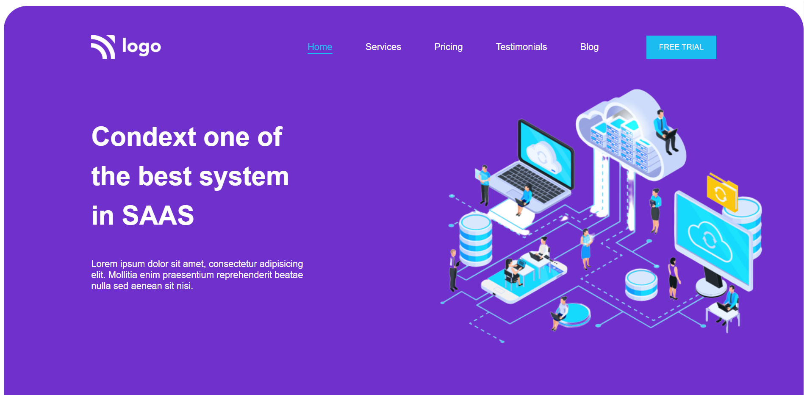
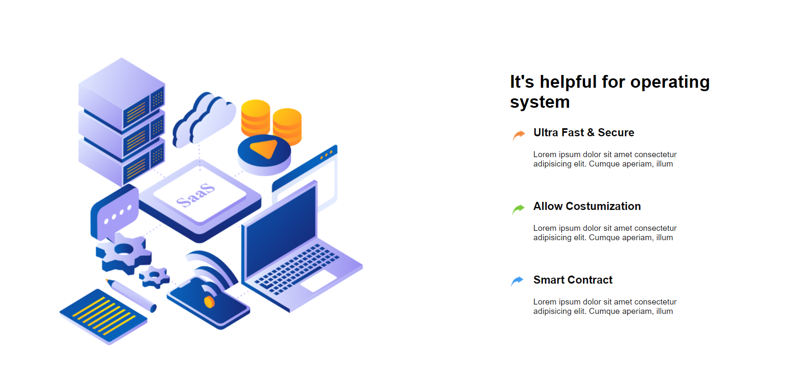
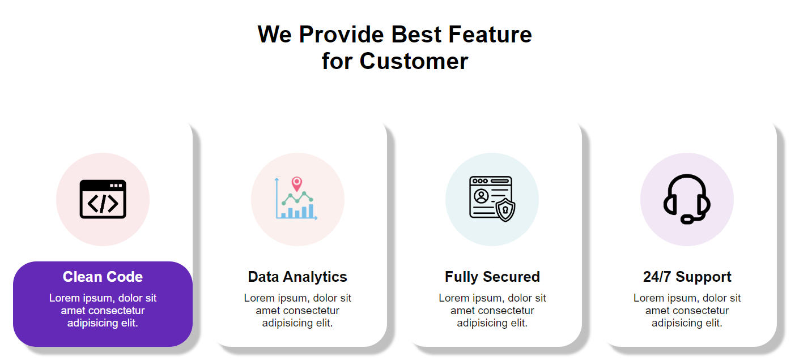

# SAAS Landing Page
Hi! I am Lalita Garg and I created this project using HTML and CSS.

A static SAAS Design Landing Page website that is responsive for mobile and tablet screen .

This Project took around 6 hours to complete it.

## Key Learning 
***
- Media Queries 
- Flex and Flexbox
- Margin and Padding 
- Position 
- Navbar Designing 
- Responsive Design

# Deployment Link
## [Live Link]()
## Preview |
***

<!-- ## Desktop view

## Tablet View

## Mobile View -->

## Technologies Used 
***

